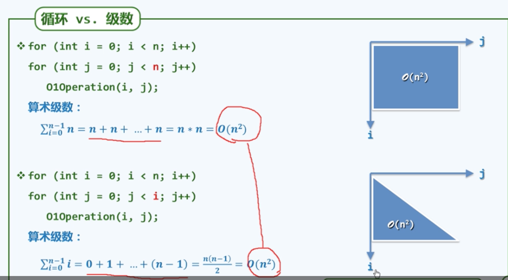
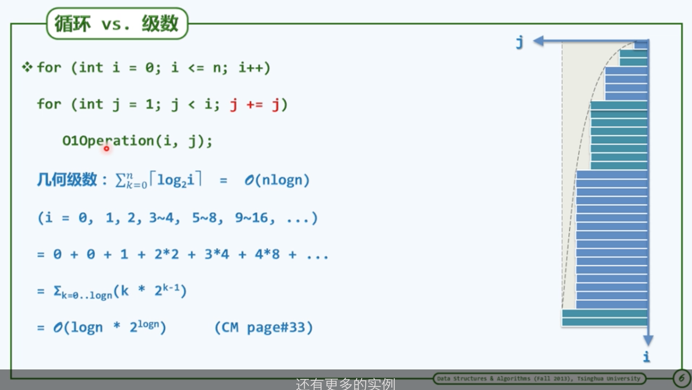
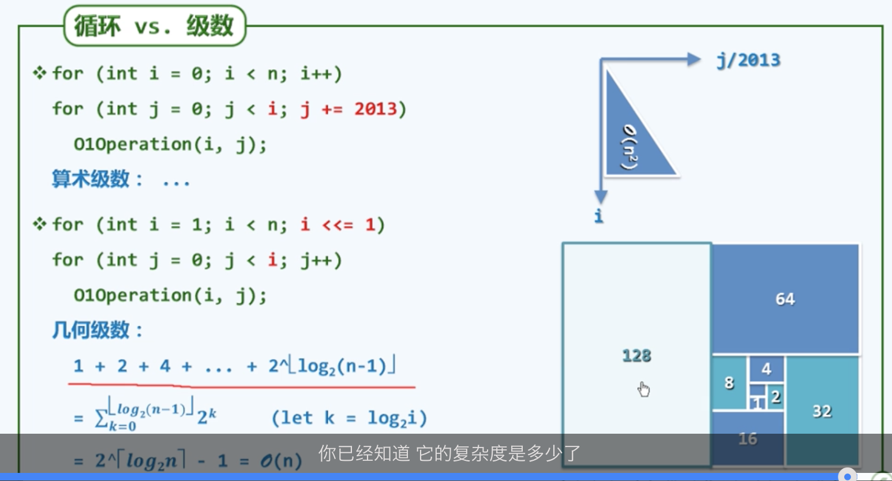

### 绪论
- 算法不一定是程序，算法需要有穷性
- 算法组重要的是效率，速度尽可能快，存储空间尽可能少
- DSA

### 方法论
- 如果问题实例有很多，那么很明显我们无法一一解决，那么我们的思路就是对问题进行分类，然后去解决这一类问题
- 如果你想改进和优化一个东西，你首先需要能够准确的测量它，你需要一把尺子
- 复杂的问题只有简化之后我们才能抓住主要的矛盾，而简化的方法就是忽略那些不重要的东西
- 去粗存精
- 迭代乃人工，递归乃神通
- 凡治众如治寡，分而治之
- 复杂问题分解为两个，一个是规模减小的问题，另一个是平凡问题

### 算法分析
时间成本和空间成本，我们更关注时间成本

## 渐进分析

### 大O记号

n足够大的时候成立就好

- 常数项可忽略
- 低次项可忽略

#### 具体的刻度
- O(1)，再大的常数都是这个复杂度2023x239238
- O(logn)
- O(n^c)多项式复杂度

### 复杂度分析主要方法
- 迭代：级数求和
- 递归：递归跟踪和递归方程
- 猜测+验证

#### 级数(迭代)

估算：
- 一天是10^5s
- 一世纪是3 x 10^9
- 普通的pc一秒是10^9次运算
- 最厉害的机器是10^15次运算

#### 递归(更高级的做法，但是效率不应最好)

